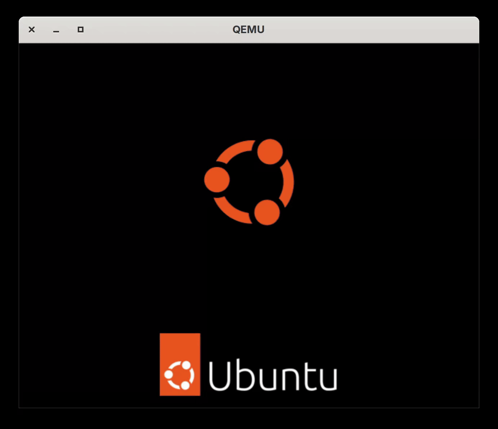

## Auto-select User at Login (a GNOME Shell Extension)
This GNOME Shell extension saves you a click at login-time by auto-selecting the only user from the list of users.
This extension is meant for systems where only a single user is displayed at the login dialog.

### Demonstration
#### (1) with the extension enabled
GDM now jumps straight to the auth prompt, saving a click.


#### (2) GDM's default behaviour
One must click the (only) user in the user list to get to the auth prompt.



### Installation
This extension uses the `"gdm"` session mode to be allowed to run on the login dialog, so it _must_ be installed as a system-wide extension and enabled for the `gdm` user:

#### Steps
1. Un-tar into `/usr/share/gnome-shell/extensions/`
   ```sh
   sudo cp autoselect-user-at-login@thaibert.com.tgz /usr/share/gnome-shell/extensions
   cd /usr/share/gnome-shell/extensions
   sudo tar xzvf autoselect-user-at-login@thaibert.com.tgz
   ```
2. Enable the extension for the `gdm` user
   ```sh
   sudo machinectl shell gdm@ /usr/bin/gnome-extensions enable autoselect-user-at-login@thaibert.com
   ```

Alternatively, clone the repo and run `make install`.

### Compatibility
The list of supported GNOME Shell versions can be found in the `"shell-version"` field in [extension/metadata.json](extension/metadata.json).

Each release (see Releases on the right) lists its supported versions as well as the corresponding releases of e.g. Fedora and Ubuntu.
